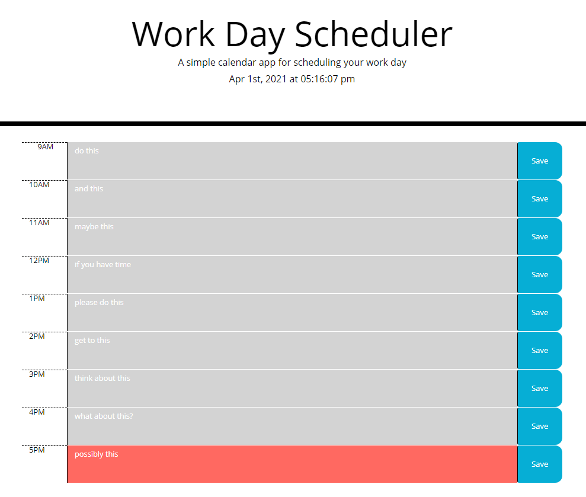

# Work Day Scheduler

The goal of this project was to create simple scheduling program using Bootstrap and JQuery that allows the user to enter tasks or notes for given block of time on their 9-5 schedule. The user can click the save button to place the data into local storage, the schedule will populate with this local storage data on page load.
The background color of each time block will change in relation to the current time; grey in the past, red in the present, and green for the future.

## Challenges
There were multiple challenges while designing this page, the first came from working with a predesigned set of CSS classes and not knowing which html elements they were intended to be placed on.   
The next challenge, which was more so an issue caused by a lack of forsight, was to assign the html elements ID in relation to their 12-hour time, instead of using a 24-Hour format, or just labeling them in ascending numerical order. This made trying to loop through them as a group problematic. The partial solution to this problem was to assign the textarea's a data-state that could be used to reference them.

## Future Improvements

Revisiting this application in the future there are definite areas for improvement. The first thing I would address is to change the labeling system for the html elements to ANYTHING but their actual 12-Hour time. The on.click events for each button are quite repetitive and far from eloquent and I'm sure could be consolidated into a single function if the buttons and textareas were numbered more intelligently. This would also reduce the number of lines in the updateTextAreas() function and could likely reduce the total number of global variables. 
  
See internal comments for further information.
  

The live version of this page can be found at: https://trev-eck.github.io/work-day-scheduler/

